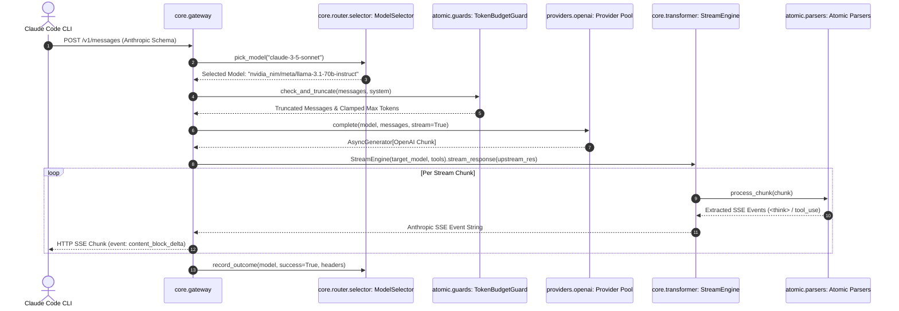

# Local System Architecture — Claude Code Proxy Gateway (Shared, Core, Atomic Architecture)

This document provides a comprehensive technical overview of the **Claude Code Proxy Gateway** codebase (`claude-code-proxy`). It details the runtime architecture, request processing pipeline, model routing hierarchy, resiliency mechanisms (Circuit Breaker, Dynamic Rate Limiter, Preflight Guard, Token Budget Guard), stateful atomic parsers, and the **Shared, Core, Atomic** modular design system.

---

## 1. System Architecture Overview

The **Claude Code Proxy Gateway** is structured into three clean, decoupled layers adhering to SOLID design principles:

```mermaid
flowchart TD
    Client[Claude Code CLI / hermes-claude] -->|Anthropic /v1/messages API| Gateway[Core Gateway: FastAPI Server :8090]
    
    subgraph Core Layer (Business Logic & Orchestration)
        Gateway --> Auth{Auth Guard x-api-key / Bearer}
        Auth --> Mock{Local Mock Intercept}
        Mock -->|Probe/Title/Completion| MockResp[Instant Local 0-Token Response]
        Mock -->|Real Prompt| Pipeline[Request Execution Pipeline]
        
        Pipeline --> Selector[core.router.selector: ModelSelector]
        Selector --> TokenGuard[atomic.guards.token_budget: TokenBudgetGuard]
        TokenGuard --> KeyRotation[providers.openai: Multi-Key Pool]
        KeyRotation --> CandidateLoop[In-Flight Candidate Fallback Loop]
        CandidateLoop --> StreamEngine[core.transformer.stream_engine: StreamEngine]
    end

    subgraph Atomic Layer (Stateful & Single-Responsibility Micro-Components)
        PreflightProbe[atomic.guards.preflight: PreflightGuard]
        SubagentGuard[atomic.guards.subagent: SubagentGuard]
        ThinkingParser[atomic.parsers.thinking: ThinkingParser]
        HeuristicParser[atomic.parsers.heuristic_tool: HeuristicToolParser]
        StreamGuard[atomic.guards.stream_guard: StreamGuard]
    end

    subgraph Shared Layer (Pure Stateless Schemas & Helpers)
        Schemas[shared.schemas: Anthropic & OpenAI Pydantic/Dataclass Models]
        SSEHelpers[shared.utils.sse_helper: SSE String Formatters & Parsers]
        Exceptions[shared.exceptions: Custom Proxy Errors]
    end

    Selector --> PreflightProbe
    StreamEngine --> ThinkingParser
    StreamEngine --> HeuristicParser
    StreamEngine --> SubagentGuard
    StreamEngine --> StreamGuard
    StreamEngine --> Schemas
    StreamEngine --> SSEHelpers
    Gateway --> Exceptions

    StreamEngine -->|Anthropic SSE Events + <think> & tool_use| Client
```

---

## 2. Directory & Package Structure

```
claude-code-proxy/
├── shared/                       # Pure Stateless Layer (Schemas, Utilities, Exceptions)
│   ├── exceptions.py             # Custom proxy error hierarchy (ProxyBaseError, CircuitOpenError, etc.)
│   ├── schemas/                  # Strong Pydantic / Dataclass data transfer objects
│   │   ├── anthropic.py          # Anthropic request/response payloads & SSE event classes
│   │   └── openai.py             # OpenAI/NIM request/response payloads & streaming deltas
│   └── utils/                    # Pure functional utility helpers
│       └── sse_helper.py         # Pure SSE event string formatting & parsing
│
├── atomic/                       # Micro-Component Layer (Single Responsibility, Stateful)
│   ├── parsers/                  # Stream parsers maintaining chunk state
│   │   ├── base.py               # BaseAtomicParser (ABC: process_chunk, flush, reset)
│   │   ├── thinking.py           # ThinkingParser (<think> tags & reasoning_content state)
│   │   └── heuristic_tool.py     # HeuristicToolParser (Markdown codeblock & JSON tool extractor)
│   └── guards/                   # Single-purpose security & context policy guards
│       ├── preflight.py          # PreflightGuard (1-token reachability probe)
│       ├── token_budget.py       # TokenBudgetGuard (tiktoken token counting & smart_truncate)
│       ├── subagent.py           # SubagentGuard (enforces run_in_background=False policy)
│       └── stream_guard.py       # StreamGuard (SSE timeout & stall detector)
│
├── core/                         # Orchestration & Business Logic Layer
│   ├── gateway.py                # Core FastAPI API route handlers (/v1/messages, /v1/models, etc.)
│   ├── router/                   # High-availability resilience & candidate selection
│   │   ├── selector.py           # ModelSelector (Candidate chain selection & fallback matching)
│   │   ├── circuit_breaker.py    # CircuitBreaker state machine (CLOSED, OPEN, HALF_OPEN)
│   │   └── rate_limiter.py       # DynamicRateLimiter (Header parsing & sliding quota)
│   └── transformer/              # Stream orchestration engine
│       └── stream_engine.py      # StreamEngine (Pipeline orchestrator calling atomic parsers)
│
├── cli/                          # Command Line Interface Layer
│   ├── main.py                   # Typer CLI commands (start server on :8090, doctor diagnostics)
│   └── session.py                # Subprocess & interactive session manager
│
├── api/                          # Interface & Monitoring Layer
│   ├── dashboard.py              # Hermes Gate Dashboard endpoints (/api/stats, /api/config)
│   └── mock.py                   # Instant 0-token local mock interceptor for probes/titles
│
├── config/                       # Configuration Layer
│   ├── config.py                 # Central Loguru logging, Pydantic settings loading (.env)
│   └── models.yaml               # Dynamic model catalog, context limits, and fallback chains
│
├── messaging/                    # Remote Administration Layer
│   ├── manager.py                # Thread-based messaging session manager
│   ├── telegram_bot.py           # Telegram bot commands & remote shell execution
│   └── discord_bot.py            # Discord bot commands & channel status updates
│
├── models/                       # Legacy Data Conversion Bridge
│   └── converter.py              # Bidirectional Anthropic <-> OpenAI structure converter
├── providers/                    # Upstream Provider Drivers
│   ├── base.py                   # BaseProvider interface
│   └── openai.py                 # OpenAICompatibleProvider (Multi-key round-robin pool)
├── tests/                        # Comprehensive Pytest Suite
│   ├── test_atomic_parsers.py    # Unit tests for atomic parsers & session manager
│   ├── test_models.py            # Unit tests for data transfer models
│   └── test_proxy.py             # 44 deterministic unit tests (Gateway, router, fallbacks)
└── server.py                     # FastAPI app entrypoint & lifespan lifecycle hooks
```

---

## 3. Layer Responsibilities & SOLID Principles

### A. Shared Katmanı (`shared/`)
- **Stateless Guarantee**: Holds no internal state. Contains pure schemas, custom exceptions, and utility functions.
- **`shared/schemas/`**: Pydantic models for `AnthropicMessageResponse`, `OpenAIChatCompletionRequest`, `SSEMessageStartEvent`, `SSEContentBlockDeltaEvent`, etc.
- **`shared/exceptions.py`**: Strong exception hierarchy (`ProxyBaseError`, `UpstreamProviderError`, `CircuitOpenError`, `RateLimitExceededError`, `ContextOverflowError`, `SubagentPolicyViolationError`).
- **`shared/utils/sse_helper.py`**: Functional `format_sse_event` and `parse_sse_line` tools.

### B. Atomic Katmanı (`atomic/`)
- **Single Responsibility Micro-Components**: Small, focused components that maintain state when processing chunked data.
- **`atomic/parsers/thinking.py`**: State machine tracking split `<think>` tags across SSE chunks.
- **`atomic/parsers/heuristic_tool.py`**: Regex parser capturing markdown codeblocks (````bash```), embedded JSON, slash commands (`/graphify`), and MCP invocations.
- **`atomic/guards/preflight.py`**: 1-token reachability probe updating model circuit breakers.
- **`atomic/guards/token_budget.py`**: Tokenizer-based context truncation (`smart_truncate`).
- **`atomic/guards/subagent.py`**: Subagent policy guard enforcing `run_in_background=False`.

### C. Core Katmanı (`core/`)
- **Business Logic & Stream Orchestration**:
- **`core/transformer/stream_engine.py`**: The `StreamEngine` acts as an orchestrator, receiving raw upstream chunk streams and piping them sequentially through atomic parsers (`ThinkingParser` -> `HeuristicToolParser` -> `SubagentGuard` -> `StreamGuard`).
- **`core/router/selector.py`**: Central `ModelSelector` picking candidate models based on availability and fallback priority.
- **`core/router/circuit_breaker.py`**: Circuit Breaker state machine (CLOSED -> OPEN -> HALF_OPEN).
- **`core/router/rate_limiter.py`**: Dynamic Rate Limiter parsing upstream headers.
- **`core/gateway.py`**: FastAPI route handlers for `/v1/messages`, `/v1/models`, `/v1/messages/count_tokens`.

---

## 4. Asynchronous Data & Control Flow Sequence



---

## 5. Model Routing & Resiliency Matrix

Configured in [config/models.yaml](file:///media/bekir/HDDStorage/PROJECTS/MY_APP/claude-code-proxy/config/models.yaml):

| Tier | Primary Model | Fallback Order | Context Limit | Max Output |
|---|---|---|---|---|
| **`claude_opus`** | `nvidia_nim/nvidia/llama-3.1-nemotron-70b-instruct` | `nvidia_nim/meta/llama-3.1-70b-instruct`, `open_router/meta-llama/llama-3.3-70b-instruct`, `open_router/google/gemini-2.5-flash` | 1,000,000 | 32,768 |
| **`claude_sonnet`** | `nvidia_nim/meta/llama-3.1-70b-instruct` | `open_router/meta-llama/llama-3.3-70b-instruct`, `open_router/google/gemini-2.5-flash`, `open_router/arcee-ai/trinity-large-preview:free` | 1,000,000 | 16,384 |
| **`claude_haiku`** | `nvidia_nim/meta/llama-3.1-8b-instruct` | `open_router/stepfun/step-3.5-flash:free`, `open_router/google/gemini-2.5-flash`, `nvidia_nim/meta/llama-3.1-70b-instruct` | 200,000 | 8,192 |
| **`claude_default`**| `nvidia_nim/nvidia/llama-3.1-nemotron-70b-instruct` | `nvidia_nim/meta/llama-3.1-70b-instruct`, `open_router/meta-llama/llama-3.3-70b-instruct`, `open_router/google/gemini-2.5-flash` | 1,000,000 | 32,768 |

---

## 6. Verification & Test Suite

The codebase includes 44 unit tests covering atomic parsers, data models, gateway auth, circuit breakers, rate limiters, token truncation, and stream guards:

- **Run all unit tests**:
  ```bash
  .venv/bin/pytest -v
  ```
- **Run ruff linter & code style check**:
  ```bash
  .venv/bin/ruff check .
  ```
