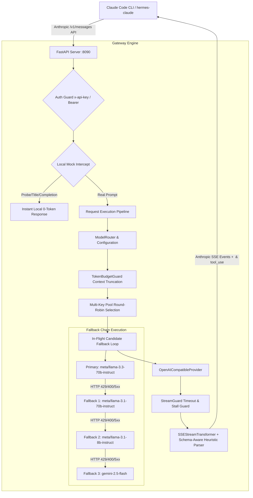

# Local System Architecture — Claude Code Proxy Gateway

This document provides a comprehensive technical overview of our local **Claude Code Proxy Gateway** codebase (`claude-code-proxy`). It documents the runtime architecture, request processing pipeline, model routing hierarchy, resiliency mechanisms (Token Budget Guard, Circuit Breaker, Stream Guard, Multi-Key Pool), schema-aware heuristic tool transformer, and telemetry dashboard.

---

## 1. System Architecture Overview

The **Claude Code Proxy Gateway** is a high-performance, resilient local proxy designed to intercept Anthropic `/v1/messages` requests from `claude-code` (or `hermes-claude` CLI) and route them seamlessly to third-party LLM providers (primarily **NVIDIA NIM** models, Google Gemini, OpenRouter, or local LM Studio/Ollama endpoints).



---

## 2. Directory & Package Structure

```
claude-code-proxy/
├── api/
│   ├── routes.py            # FastAPI route handlers (/v1/messages, /count_tokens, /v1/models)
│   ├── stream_transformer.py # SSEStreamTransformer + Schema-Aware Heuristic Tool Call Parser
│   ├── mock.py              # Instant 0-token local mock generator for CLI probes & titles
│   └── dashboard.py         # Live Monitor UI & telemetry stats endpoints (/api/stats, /api/config)
├── providers/
│   ├── base.py              # BaseProvider interface & Anthropic <-> OpenAI message/tool translation
│   └── openai.py            # OpenAICompatibleProvider (Multi-key rotation & httpx streaming)
├── router/
│   ├── model_router.py      # ModelRouter singleton, candidate selection & preflight probe
│   ├── circuit_breaker.py   # CircuitBreaker state machine (CLOSED, OPEN, HALF_OPEN)
│   └── rate_limit_parser.py # SlidingWindowRateLimiter header parser
├── guards/
│   ├── token_budget.py      # TokenBudgetGuard: tiktoken token counting & context clipping
│   ├── stream_guard.py       # StreamGuard: stall & chunk timeout safety wrapper
│   └── preflight.py         # Light 1-token probe check for provider reachability
├── config/
│   ├── config.py            # Central Loguru logging, Pydantic settings loading (.env, paths)
│   └── models.yaml          # Model mapping hierarchies, context limits, and fallback chains
├── messaging/
│   ├── manager.py           # Thread-based messaging session manager
│   ├── telegram_bot.py      # Optional Telegram bot integration
│   └── discord_bot.py       # Optional Discord bot integration
├── cli/
│   └── main.py              # Typer CLI commands (start server on :8090, doctor diagnostics)
├── tests/
│   └── test_proxy.py        # 28 deterministic pytest unit tests
└── server.py                # FastAPI app instantiation & lifespan lifecycle hooks
```

---

## 3. Core Technical Subsystems

### A. Schema-Aware Heuristic MCP & Command Builder ([api/stream_transformer.py](file:///media/bekir/HDDStorage/PROJECTS/MY_APP/claude-code-proxy/api/stream_transformer.py))
When non-Anthropic models (e.g. Llama 3.3 or GLM-4) emit slash commands or text-based command simulations (e.g., `/mcp__stitch__generate_screen_from_text`, `/graphify`, `pnpm dev`, `git status`), the proxy's `parse_heuristic_tool_call` and `build_heuristic_input` intercept the text stream on-the-fly:
- **Universal Slash & Command Resolver**: Matches slash commands (`/command`) and CLI tools (`pnpm dev`, `git status`) against registered `tools`.
- **Dynamic Schema Inspection**: Inspects the target tool's `input_schema` to populate expected parameters (`description`, `prompt`, `input`, `text`, `CommandLine`).
- **Zero JSON Validation Failures**: Generates valid Anthropic `tool_use` SSE events so Claude Code CLI executes MCP skills and terminal commands without breaking.

### B. Multi-Key Rotation Pool ([providers/openai.py](file:///media/bekir/HDDStorage/PROJECTS/MY_APP/claude-code-proxy/providers/openai.py))
- Supports single API key strings and comma-separated key lists (`NVIDIA_NIM_API_KEY="key1, key2, key3"`).
- `_select_key` performs thread-safe round-robin key selection per provider request, multiplying provider rate limits and avoiding single-key RPM bottlenecks.

### C. Per-Model Thinking Mode Controls ([config/config.py](file:///media/bekir/HDDStorage/PROJECTS/MY_APP/claude-code-proxy/config/config.py) & [api/routes.py](file:///media/bekir/HDDStorage/PROJECTS/MY_APP/claude-code-proxy/api/routes.py))
- Independent reasoning controls per model tier (`THINKING_MODE_OPUS`, `THINKING_MODE_SONNET`, `THINKING_MODE_HAIKU`, `THINKING_MODE_DEFAULT`).
- **3 States**:
  - `open`: Enforces `<think>...</think>` step-by-step reasoning directive.
  - `inherit`: Default native model behavior (forces native `tool_calls`).
  - `close`: Suppresses reasoning prompt directives.
- Dynamic dropdown controls available on the Dashboard UI.

### D. In-Flight Candidate Fallback Loop ([api/routes.py](file:///media/bekir/HDDStorage/PROJECTS/MY_APP/claude-code-proxy/api/routes.py))
When a client sends a message request, `messages_endpoint` builds a candidate list: `candidates = [primary] + fallbacks`.
- **HTTP 429 Rate Limit**: Automatically zeroes remaining quota for that candidate model and immediately attempts the next fallback candidate (e.g. OpenRouter free models).
- **HTTP 400/5xx Error**: Calls `cb.force_open()` on the model's circuit breaker and immediately retries the request using the next candidate.
- **Zero Client Interruption**: The client never sees HTTP 429, 400, or 500 errors if any model in the candidate chain is available.

### E. Live Monitor Dashboard UI ([api/dashboard.py](file:///media/bekir/HDDStorage/PROJECTS/MY_APP/claude-code-proxy/api/dashboard.py))
- Real-time auto-refreshing request trace feed at `/dashboard`.
- Tracks request timestamp, `client_model` ➔ `mapped_model` mappings, latency in `ms`, HTTP status code, and yellow `FALLBACK (Count)` badges for automatic failovers.

---

## 4. Model Routing & Fallback Hierarchies

Defined in [config/models.yaml](file:///media/bekir/HDDStorage/PROJECTS/MY_APP/claude-code-proxy/config/models.yaml):

| Tier | Primary Model | Fallback Order | Context Limit | Max Output |
|---|---|---|---|---|
| **`claude_opus`** | `nvidia_nim/meta/llama-3.3-70b-instruct` | `open_router/google/gemini-2.5-flash:free`, `open_router/meta-llama/llama-3.3-70b-instruct:free`, `nvidia_nim/meta/llama-3.1-70b-instruct` | 131,072 | 32,768 |
| **`claude_sonnet`** | `nvidia_nim/meta/llama-3.1-70b-instruct` | `open_router/google/gemini-2.5-flash:free`, `open_router/meta-llama/llama-3.3-70b-instruct:free`, `nvidia_nim/meta/llama-3.3-70b-instruct` | 128,000 | 16,384 |
| **`claude_haiku`** | `nvidia_nim/meta/llama-3.1-8b-instruct` | `open_router/google/gemini-2.5-flash:free`, `open_router/meta-llama/llama-3-8b-instruct:free` | 32,768 | 8,192 |
| **`claude_default`**| `nvidia_nim/meta/llama-3.1-70b-instruct` | `open_router/google/gemini-2.5-flash:free`, `open_router/meta-llama/llama-3.3-70b-instruct:free` | 128,000 | 16,384 |

---

## 5. Endpoints & API Specifications

- `POST /v1/messages`: Main Anthropic Messages streaming gateway.
- `POST /v1/messages/count_tokens` & `/v1/messages/tokens/count`: Calculates exact input prompt tokens for Claude Code budget queries.
- `GET /v1/models`: Returns available gateway model catalog formatted for Anthropic API.
- `GET /api/stats`: Telemetry dashboard statistics (active concurrency, total requests, token counts).
- `GET /api/config` & `POST /api/config`: Admin configuration management.

---

## 6. Test Suite & Verification

The codebase includes 28 comprehensive unit tests in [tests/test_proxy.py](file:///media/bekir/HDDStorage/PROJECTS/MY_APP/claude-code-proxy/tests/test_proxy.py):
- `test_multi_key_rotation`: Validates round-robin multi-key selection.
- `test_in_flight_429_auto_retry_fallback`: Asserts automatic retry across model candidates on 429/400 errors.
- `test_token_budget_guard_truncation`: Verifies prompt truncation and block clipping.
- `test_stream_transformer_with_think_tags`: Validates `<think>` tag extraction.
- `test_heuristic_tool_call_parser`: Validates JSON, slash command (`/graphify`, `/mcp...`), and terminal command matching.

Run all tests:
```bash
.venv/bin/pytest -v
```
Check code quality:
```bash
.venv/bin/ruff check .
```
